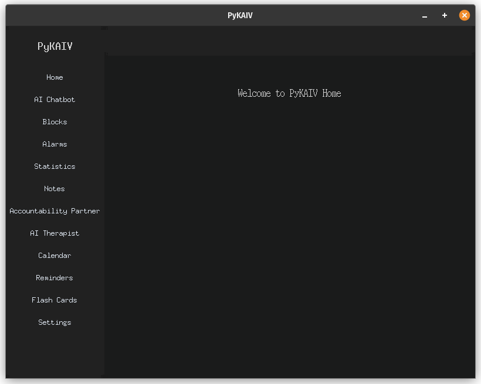
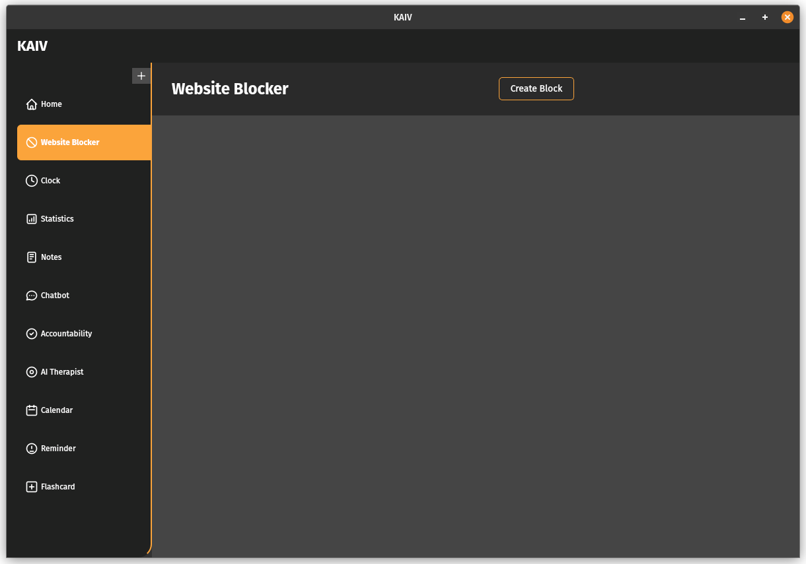

# **KAIV - The Ultimate Productivity Suite**

KAIV (Keep AI Versatile) is a full-featured productivity application designed to help you stay focused, organized, and balanced. Whether you're battling distractions, managing your time effectively, or enhancing your mental well-being, KAIV provides all the tools you need to boost productivity and maintain a healthy work-life balance.

---

## **Table of Contents**
1. [Introduction](#introduction)
2. [Features](#features)
   - [Website and App Blocker](#1-website-and-app-blocker)
   - [Clock Suite](#2-clock-suite)
   - [Statistics and Analytics](#3-statistics-and-analytics)
   - [Note Taker](#4-note-taker)
   - [AI Productivity Chatbot](#5-ai-productivity-chatbot)
   - [Accountability Partner](#6-accountability-partner)
   - [AI Therapist](#7-ai-therapist)
   - [Calendar Integration](#8-calendar-integration)
   - [Reminders](#9-reminders)
   - [Flash Cards](#10-flash-cards)
3. [Technical Stack](#technical-stack)
4. [Installation](#installation)
5. [Future Roadmap](#future-roadmap)
6. [Contribution Guidelines](#contribution-guidelines)
7. [License](#license)

---

## **Introduction**

KAIV is more than just a productivity app; it's a comprehensive suite that combines multiple tools into a unified experience. From blocking distractions to tracking time, setting alarms, and offering mental wellness support, KAIV provides everything you need to achieve your goals efficiently.

---

## **Features**

### **1. Website and App Blocker**
- Block distracting websites and apps to stay focused.
- Customizable blocklists for work, study, or relaxation periods.
- Schedule blocks for specific hours (e.g., working hours).
- **Whitelisting:** Allow specific websites/apps for essential tasks.
- **Password-protection:** Prevent bypassing blocks for accountability.

---

### **2. Clock Suite**
A comprehensive time management toolkit, including:
- **World Clock:** Display time zones for global collaborations.
- **Alarms:** Set reminders for important activities.
- **Timer:** Standard countdown timers for specific tasks.
- **Pomodoro Timer:** A built-in Pomodoro technique timer for structured work intervals.

---

### **3. Statistics and Analytics**
- Track your productivity trends over time.
- Generate reports on focus time, distractions blocked, and task completion.
- Visualize your progress with intuitive charts and graphs.

---

### **4. Note Taker**
- Take notes quickly and organize them efficiently.
- Categorize notes (e.g., Work, Study, Ideas, Personal).
- Support for rich text, images, and to-do lists.
- Sync notes across devices for easy access.

---

### **5. AI Productivity Chatbot**
- An intelligent chatbot designed to guide your productivity.
- Offers task prioritization advice, goal tracking, and motivation.
- Suggests productivity techniques like Pomodoro, time-blocking, etc.
- Provides summaries for tasks or workflows to help with decision-making.

---

### **6. Accountability Partner**
- Collaborate with real partners or an AI accountability buddy.
- Helps you stay responsible for your goals and tasks.
- Share progress reports and receive reminders from your partner.

---

### **7. AI Therapist**
- A supportive, conversational therapist powered by AI.
- Helps users manage stress, anxiety, or mental fatigue.
- Provides personalized advice and coping mechanisms.
- Tracks mood over time to help identify patterns.

---

### **8. Calendar Integration**
- Integrate with Google Calendar, Outlook, or other services.
- View daily, weekly, and monthly schedules in-app.
- Plan your day efficiently with time-blocking features.

---

### **9. Reminders**
- Set personalized reminders for tasks, deadlines, and events.
- Integrates seamlessly with your calendar for scheduling.
- **Recurring Reminders:** Daily, weekly, or monthly events.

---

### **10. Flash Cards**
- Create flash cards to aid in learning and revision.
- Supports images, text, and spaced repetition for effective studying.
- A must-have feature for students or knowledge enthusiasts.

---

## **Technical Stack**
- **Programming Language:** Python
- **GUI Framework:** Tkinter or CustomTkinter
- **AI Models:** OpenAI GPT (for chatbot and therapist features)
- **Database:** SQLite or PostgreSQL for note storage and reminders
- **Integration Tools:** Calendar APIs (Google Calendar), web blockers

---

## **Installation**
1. Clone the repository:
   ```bash
   git clone https://github.com/Mohammed-Sattar/kaiv-productivity-suite.git
   cd kaiv-productivity-suite
   ```
2. Install dependencies:
   ```bash
   pip install -r requirements.txt
   ```
3. Run the application:
   ```bash
   python main.py
   ```

---

## **Future Roadmap**
- Add voice input for the AI chatbot and therapist.
- Mobile app version for Android/iOS.
- Cloud sync for data and cross-device usage.
- Integration with task managers like Trello or Asana.
- Custom themes and user profiles.

---

## **Contribution Guidelines**
We welcome contributions! If you'd like to add features, fix bugs, or improve documentation, feel free to submit a pull request. Follow the steps below:
1. Fork the repository.
2. Create a feature branch.
3. Test thoroughly.
4. Submit a pull request with a detailed description.

---

## **License**
This project is licensed under the [CC BY-NC](https://creativecommons.org/licenses/by-nc/4.0/) License. See `LICENSE` for more details.

---

## **Screenshots**

Sample Interfaces:  





